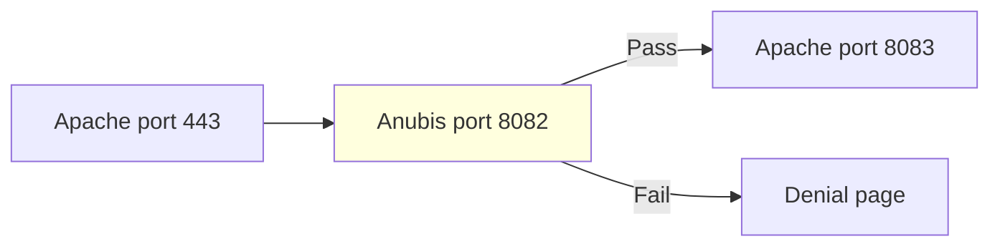

It looks like using Mermaid diagrams will result in a gigantic
CSS file (6367580 bytes, or around 6.3 MB).
<!--more-->

```mermaid
flowchart LR
    A["Apache port 443"]
    B["Anubis port 8082"]
    style B fill:#ffffde
    C["Apache port 8083"]
    D["Denial page"]
    A-->B
    B-->|Pass|C
    B-->|Fail|D
```

